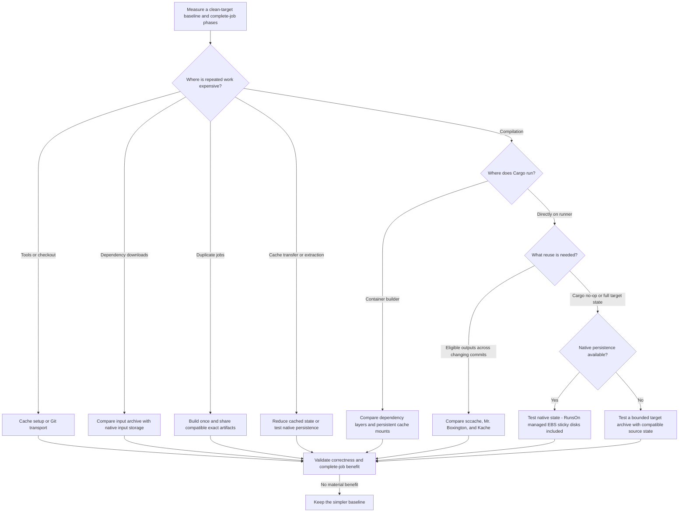

# Approaches

This category owns strategy selection, combinations, and tradeoffs. [Decisions](../decisions/README.md) owns adoption status, [Providers](../providers/README.md) maps strategies to services and their blog posts, and [cache layers](../concepts/cache-layers.md) explains how the mechanisms combine.

Apply the [open-source, direct GitHub Actions scope](../README.md#scope-and-applicability) before implementing a branch. Provider services and other-platform examples supply research ideas; listing them here does not make their hosted implementation an adoption candidate.

## Decision Tree

Follow the relevant route below. This flow chooses an experiment, not a universal winner. On RunsOn, use the [quickstart](../quickstart.md) and [deployment map](../deployments/runs-on/README.md) for the current practical starting point. For source-mtime rebuilds, use [freshness diagnosis](../operations/diagnosing-rebuilds.md); the [content-fingerprint alternative](../research/cargo-freshness-alternatives.md) remains a nightly experiment.

For named implementations use [Tools](../tools/README.md); for where their state lives use [storage topologies](../concepts/storage-topologies.md).

## CI strategy map

These families cover the reusable mechanisms represented in this archive, including optimizations that reduce work without being caches. Provider pages identify the documented deployment and source limits; an absent provider entry means not assessed.

| Strategy family                                            | Canonical explanation                                                                                                                                             | Provider or primary-source route                                                                                                                            |
| ---------------------------------------------------------- | ----------------------------------------------------------------------------------------------------------------------------------------------------------------- | ----------------------------------------------------------------------------------------------------------------------------------------------------------- |
| No Rust cache as control; clean local target               | [Clean target](clean-target.md)                                                                                                                                   | [RunsOn baseline](../deployments/runs-on/README.md)                                                                                                         |
| Cached tool setup and prebuilt images                      | [Mise setup](../operations/mise-tool-setup.md), [work reuse](../operations/ci-work-reuse.md)                                                                      | [WarpBuild snapshots](../providers/warpbuild.md), [container builds](container-builds.md)                                                                   |
| Git mirrors or cached Git objects                          | [Preparation and checkout](../operations/ci-work-reuse.md#preparation-and-checkout)                                                                               | [RunsOn](../providers/runs-on.md), [Actuated](../providers/actuated.md)                                                                                     |
| Cargo input archives                                       | [rust-cache behavior](../concepts/rust-cache-behavior.md)                                                                                                         | [RunsOn](../providers/runs-on.md), [Blacksmith](../providers/blacksmith.md), [Ubicloud](../providers/ubicloud.md), [WarpBuild](../providers/warpbuild.md)   |
| Faster or self-hosted archive transport                    | [Cache primitives](../concepts/cache-primitives.md)                                                                                                               | [Provider map](../providers/README.md), including [Actuated S3-compatible storage](../providers/actuated.md)                                                |
| Full target archive with compatible checkout               | [Mtime-preserving checkout](rust-cache-mtime-checkout.md), [source-keyed target](rust-cache-source-keyed-target-cache.md)                                         | [Core archive clients](../reference/vendor-ci-cache-sources.md)                                                                                             |
| Compiler/build-action object reuse                         | [sccache vs Mr. Boxington vs Kache](../tools/compiler-caches.md)                                                                                                  | [RunsOn](../providers/runs-on.md), [Namespace](../providers/namespace.md), [Depot](../providers/depot.md), [WarpBuild guide](../providers/warpbuild.md)     |
| Native Cargo inputs, target, or compiler-cache store       | [Persistent state](persistent-state.md)                                                                                                                           | [Namespace](../providers/namespace.md), [Blacksmith](../providers/blacksmith.md), [RunsOn](../providers/runs-on.md), [Depot CI beta](../providers/depot.md) |
| Managed EBS snapshots or broader VM snapshots              | [Persistent state](persistent-state.md)                                                                                                                           | [RunsOn sticky disks](../deployments/runs-on/README.md#sticky-disk-options), [WarpBuild Cloud Ubuntu](../providers/warpbuild.md)                            |
| Custom filesystem snapshot lifecycle                       | [Archived EBS implementation](ebs-snapshot.md)                                                                                                                    | [Snapshot action](../../examples/actions/snapshot/README.md)                                                                                                |
| Container dependency layers and cargo-chef                 | [Container builds](container-builds.md)                                                                                                                           | [Earthly](../providers/earthly.md), [Depot](../providers/depot.md), Docker/cargo-chef primary docs on the approach page                                     |
| BuildKit cache mounts and persistent builders              | [Container builds](container-builds.md)                                                                                                                           | [Earthly](../providers/earthly.md), [Depot](../providers/depot.md), [Blacksmith](../providers/blacksmith.md), [RunsOn](../providers/runs-on.md)             |
| Build once, artifact fan-out, skip/cancel unnecessary jobs | [CI work reuse](../operations/ci-work-reuse.md)                                                                                                                   | GitHub workflow/artifact documentation on the operation page                                                                                                |
| CPU/RAM/NVMe tuning and distributed compilation            | [Measurement](../operations/measuring-cache-performance.md), [remaining work](../operations/ci-work-reuse.md#avoid-unnecessary-execution-and-tune-remaining-work) | Provider case studies and upstream sccache distributed docs; not persistence by themselves                                                                  |
| Network filesystem for Cargo target                        | [S3 Files](s3-files.md)                                                                                                                                           | Rejected for the measured target workload; not a rejection of every network filesystem                                                                      |
| Freshness based on contents rather than mtimes             | [Cargo freshness alternatives](../research/cargo-freshness-alternatives.md)                                                                                       | Cargo nightly docs and stabilization trackers; not a stable default                                                                                         |
| New object-cache transports, local tiers, and gateways     | [RunsOn research ownership map](../research/runs-on-sccache/README.md)                                                                                            | Proposed designs with one [roadmap](../research/runs-on-sccache/roadmap.md); no implied adoption                                                            |

## Decision Matrix

Use this compact status map with the [canonical decisions](../decisions/README.md). Detailed tradeoffs and copyable examples are owned by the linked pages.

| Choice                                                      | Archive status                                                                                | Next step                                                                                                                 |
| ----------------------------------------------------------- | --------------------------------------------------------------------------------------------- | ------------------------------------------------------------------------------------------------------------------------- |
| Clean local target, optional input archive                  | Practical baseline; no Rust cache remains the control.                                        | [Clean target](clean-target.md)                                                                                           |
| Compiler/build-action cache                                 | sccache and Mr. Boxington object mode are qualified canary candidates; Kache is untested.     | [Three-tool comparison](../tools/compiler-caches.md)                                                                      |
| Whole-target archive                                        | Conditional, narrow workload; bounded size and compatible source/build state.                 | [Mtime-preserving checkout](rust-cache-mtime-checkout.md), [source-keyed target](rust-cache-source-keyed-target-cache.md) |
| Native inputs or target, including managed EBS sticky disks | Unmeasured here; Cargo inputs before custom target persistence on RunsOn.                     | [Persistent state](persistent-state.md), [RunsOn sticky options](../deployments/runs-on/README.md#sticky-disk-options)    |
| Custom EBS snapshot action                                  | Archived implementation with measured no-op fidelity.                                         | [Custom snapshot](ebs-snapshot.md)                                                                                        |
| Container layers and persistent BuildKit mounts             | Source-backed strategies; not benchmarked here.                                               | [Container builds](container-builds.md), [cargo-chef](../tools/cargo-chef.md)                                             |
| S3 Files for Cargo target                                   | Rejected for the measured target workload.                                                    | [S3 Files](s3-files.md)                                                                                                   |
| Content-based Cargo freshness                               | Nightly watchlist; not the stable default.                                                    | [Freshness alternatives](../research/cargo-freshness-alternatives.md)                                                     |

## Compatibility Rule

Do not combine archive and native-state owners for the same Cargo paths. See the [canonical path ownership rule](../concepts/cargo-path-coverage.md#compatibility-rule-canonical). Tool setup and a compiler cache can complement one another; two tools competing for `RUSTC_WRAPPER` need explicitly supported and tested composition.

## Architecture Diagrams

Keep diagrams beside the canonical explanation of the behavior they represent:

- [`rust-cache` with mtime-preserving checkout](rust-cache-mtime-checkout.md#architecture)
- [`rust-cache` with source-keyed full target cache](rust-cache-source-keyed-target-cache.md#architecture)
- [S3-backed `sccache`](../tools/sccache.md#design)
- [RunsOn archive, compiler-cache, and sticky-disk choices](../deployments/runs-on/README.md)
- [Filesystem snapshot lifecycle](ebs-snapshot.md#architecture)
- [S3 Files network-filesystem experiment](s3-files.md#architecture)
- [Cargo freshness decision model](../concepts/cargo-freshness-model.md)
