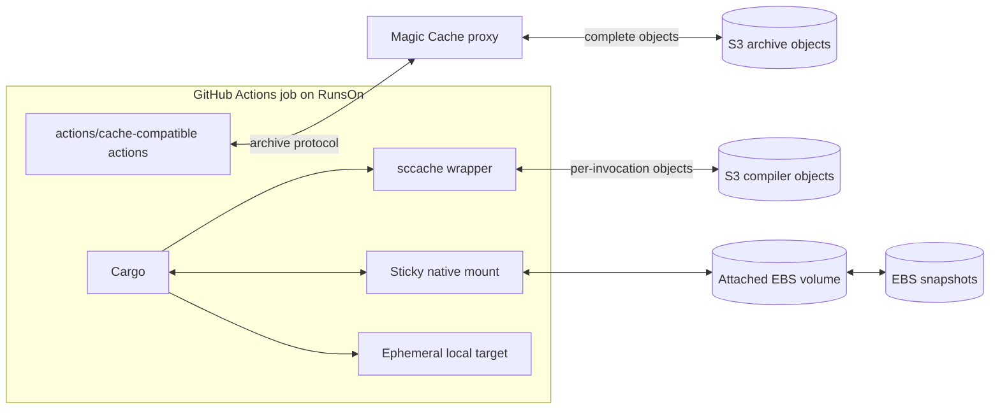

# RunsOn Cache And Disk Details

This page preserves the detailed ownership, data-flow, lifecycle, and isolation notes behind the [RunsOn deployment map](../deployments/runs-on/README.md). The platform documentation and released action were refreshed on September 6, 2026. This is source review, not a new AWS deployment; see the [version boundary](../deployments/runs-on/README.md#version-boundary) and [source catalog](../providers/runs-on.md).

## State Ownership

| Mechanism                                | Persistent state                                                                                            | Data movement                                                                 | `target/` at job start   | Primary invalidation unit                 | Writer model                                   |
| ---------------------------------------- | ----------------------------------------------------------------------------------------------------------- | ----------------------------------------------------------------------------- | ------------------------ | ----------------------------------------- | ---------------------------------------------- |
| Magic Cache with input-only `rust-cache` | Cargo registry and Git inputs; optional mise tool state                                                     | Restore and save compressed archives through the cache protocol               | Clean                    | Complete archive key                      | Prefer one trusted default-branch writer       |
| Magic Cache with whole-target cache      | Cargo inputs and a cleaned or complete target tree                                                          | Restore, extract, clean, recompress, and upload the complete selected archive | Restored archive         | Complete archive key and fallback lineage | One trusted writer; exact source/build lineage |
| Direct S3 `sccache`                      | Independently keyed eligible compiler outputs                                                               | Per-compiler-call object lookup, materialization, and optional write          | Clean                    | One compiler invocation                   | Trusted writers enforced by IAM                |
| Sticky built-in `rust` mode              | Cargo registry and Git directories on a native disk                                                         | Restore and commit EBS-backed disk snapshots                                  | Clean                    | Disk lineage                              | Last completed clean snapshot in the lineage   |
| Sticky custom target                     | Native Cargo inputs and target filesystem                                                                   | Restore and commit EBS-backed disk snapshots                                  | Native persistent target | Disk lineage and Cargo freshness          | Partition or serialize writers                 |
| Local archived EBS snapshot action       | Explicit mounted filesystem subtree, potentially including workspace, Cargo home, target, and helper caches | Create, attach, mount, unmount, detach, and snapshot an EBS volume            | Native persistent target | Workflow-defined snapshot key/lineage     | Workflow-owned lifecycle and save policy       |

Keep each path under one owner. In particular, do not let `rust-cache` clean a target or Cargo-home directory that a sticky disk or filesystem snapshot is intended to preserve natively.

## Backend Boundaries



Magic Cache changes the backend for compatible archive actions. It does not change their keys, selected paths, extraction, cleanup, exact-hit behavior, or save rules. Direct `sccache` and sticky disks bypass that archive path and need separate lifecycle and trust controls.

## Lifecycle Comparison

### Magic Cache Archive

```text
compute primary and fallback keys
restore one immutable archive
download and extract all selected contents
run the workload
optional action-specific cleanup
compress all selected contents
save a new immutable object after a miss or partial restore
```

The [RunsOn Magic Cache documentation](https://runs-on.com/docs/performance/caching/actions/), rechecked on September 6, 2026, describes a fixed S3 Lifecycle window with a 10-day default and expiration rounded up to the next midnight UTC. Restoring an object does not renew that window, so the default schedule retains a newly created object for about 10–11 days rather than 10 days since its last use.

Backend lifecycle deletes complete old objects. It cannot remove stale files from the active object. More storage capacity, shorter retention, a faster S3 link, or a new key prefix does not eliminate extraction and recompression of a large current archive.

GitHub cache inventory commands are not necessarily the operational control plane for a third-party S3-backed cache object. Confirm deletion, expiration, and object size against the configured RunsOn backend rather than assuming the GitHub cache API can see or remove it.

### Direct S3 `sccache`

```text
Cargo issues compiler request
sccache computes an invocation key
hit  -> fetch and materialize matching outputs
miss -> compile locally and optionally upload outputs
Cargo continues build scripts, orchestration, unsupported outputs, and linking
```

Old objects consume storage until lifecycle expiration, but a job does not reconstruct every old object into one target tree. The residual floor is Cargo orchestration, non-cacheable calls, linking, and many individual object operations.

### Sticky Disk

```text
select newest clean snapshot in the disk lineage
create and attach an EBS volume
mount configured paths
run directly on the native filesystem
unmount cleanly
record the resulting snapshot as the newest lineage state
```

No tar archive is created or extracted. Native persistence removes archive serialization but transfers cleanup responsibility to the disk owner.

### Archived Local Snapshot Action

The archived local action follows a similar volume lifecycle but exposes snapshot identity, save policy, retention, mount layout, and credential scrubbing directly to the workflow. It offers more explicit control at the cost of broader EC2/EBS permissions and custom maintenance.

## Sticky-Disk Lineage And Fallback

The released RunsOn sticky-disk design derives a lineage from repository identity, the explicit sticky cache name, Git ref, operating system, and architecture.

- A branch first restores its newest clean snapshot.
- If the branch has no usable snapshot, it can fall back to the repository default branch.
- A pull-request job can consume default-branch state without writing into the default-branch lineage.
- Concurrent jobs start from independent volumes based on the chosen snapshot.
- The latest job whose post step records a clean unmount becomes the newest state for that lineage.
- A failed or cancelled job can still advance the lineage if its post step reaches the clean-unmount record.
- Inactive lineages expire after the configured service interval; the documented default is 10 days.

For a mutable target, use concurrency controls or separate lineages for workloads with different profiles, features, targets, or trust levels. Test cancellation and failure paths instead of assuming only successful builds can update persistent state.

## Sticky-disk initialization and isolation

The [current capability guide](https://runs-on.com/docs/runners/capabilities/sticky-disks/) specifies GP3 defaults of 3,000 IOPS and 400 MiB/s throughput. Restoring a snapshot requests 200 MiB/s provisioned initialization by default, independently of normal volume throughput; a blank volume does not need initialization. The label accepts `100mibps-init` through `300mibps-init`, or `lazy-init` to avoid the provisioned-initialization charge at the cost of potentially slower first reads. Capacity/quota failures can fall back to lazy initialization with a warning. Include initialization, live volume, and retained snapshot costs in comparisons.

The [v3.2 upgrade guide](https://runs-on.com/docs/maintenance/v3-2-upgrade/) treats `EnableStickyDiskIsolation` (CloudFormation) / `enable_stickydisk_isolation` (Terraform Flex/Fleet) separately from Magic Cache isolation. It removes legacy runner-side EBS permissions while managed sticky operations stay in the control plane. A workflow using `runs-on/snapshot@v1` or the archive's custom derivative must migrate before that flag is enabled.

## Sticky-Disk Capacity And Reset

Non-BuildKit sticky modes do not provide selective Cargo-aware garbage collection.

The released action reports low-capacity warnings when:

- Free disk space falls below 20%.
- Free inodes fall below 10%.

At action start, if either free space or free inodes is below 5%, the action attempts a reset before cache-hit detection. It warns and skips that automatic reset when mount or mode state indicates the cache is already in use.

Treat those thresholds as last-resort platform behavior, not the experiment's operating target. Record bytes, file count, free space, and free inodes; set an earlier project-specific reset threshold; and test a manual lineage reset before adoption.

## Sticky-disk failure boundary

Source refresh: 2026-09-06, pinned to `runs-on/action` v2.3.1. The [sticky-disk capability page](https://runs-on.com/docs/runners/capabilities/sticky-disks/) describes unavailable storage as a setup failure and mentions a five-minute wait. The [released implementation](https://github.com/runs-on/action/blob/v2.3.1/internal/stickydisk/stickydisk.go) distinguishes these states:

| State                                                    | Released action behavior                                                                           |
| -------------------------------------------------------- | -------------------------------------------------------------------------------------------------- |
| Agent explicitly creates the terminal unavailable marker | Warns, leaves `cache-hit` false, continues without sticky caches, and skips sticky post-job hooks. |
| Required agent contract variables are missing            | Setup error; the wrapper has not yet had an opportunity to provide its own fallback.               |
| No ready/unavailable marker arrives before the deadline  | Setup error. A ready marker is waited for, not required to exist immediately.                      |
| A ready marker exists but the mount is invalid           | Setup validation error.                                                                            |

The [v2.3.1 tests](https://github.com/runs-on/action/blob/v2.3.1/internal/stickydisk/stickydisk_test.go) include continuing on explicit unavailability and erroring on timeout. The [action metadata](https://github.com/runs-on/action/blob/v2.3.1/action.yml) and implementation use a 15-minute default; set `sticky_wait_timeout: 15m` explicitly. This is pinned source behavior, not a live failure-injection result. Test each state in the deployed platform instead of treating all missing-disk states as equivalent.

## Magic Cache Isolation

RunsOn v3.2 documents optional repository and branch isolation for the Magic Cache protocol. It is disabled by default for backward compatibility.

When enabled:

- New protocol cache objects use the scoped namespace.
- Existing unscoped objects become cold and expire according to normal backend lifecycle.
- Workflows that intentionally share cache objects across repositories or branches must be reviewed.

This isolates cache-protocol credentials, not arbitrary direct S3 clients. It does not protect a direct `sccache` bucket or prefix from workflow code that inherits broader runner-role permissions.

The same [v3.2 upgrade guide](https://runs-on.com/docs/maintenance/v3-2-upgrade/) records a Fleet-specific cold classic-cache transition even when isolation remains disabled: the previous empty repository prefix is corrected to `cache/v1/<owner>/<repo>/...`. Do not attribute every first miss after an upgrade to enabling isolation.

## Runner-local and shared storage

| Capability                                                                                     | Current documented placement and lifetime                                                                                                                                                                       | Deployment implications                                                                                                                                                                                               |
| ---------------------------------------------------------------------------------------------- | --------------------------------------------------------------------------------------------------------------------------------------------------------------------------------------------------------------- | --------------------------------------------------------------------------------------------------------------------------------------------------------------------------------------------------------------------- |
| [Local instance-store NVMe](https://runs-on.com/docs/runners/capabilities/local-storage-nvme/) | Linux stripes available instance-store devices as ext4 under `/mnt/ephemeral`, relocating runner home, Docker state, and temporary files. Windows v3.2+ uses NTFS/Storage Spaces for the runner work directory. | Automatic on compatible instance types; no instance-store device means root-EBS fallback. Reboot differs from stop/hibernate/termination, which loses this storage.                                                   |
| [tmpfs / YOLO](https://runs-on.com/docs/runners/capabilities/yolo-mode/)                       | Linux Flex/Fleet only. `/tmp` and `/home/runner` use overlays; `/var/lib/docker` is bind-mounted to RAM-backed storage. The documented cap can use all runner memory.                                           | Takes precedence over Linux NVMe setup. Track tmpfs utilization separately from process memory. Docker state disappears on stop/start; recreate required containers in prerun/job hooks for stopped pools.            |
| [EFS](https://runs-on.com/docs/runners/capabilities/shared-volumes/)                           | Linux Flex only, mounted at `/mnt/efs` with `extras=efs`; explicitly enable `EnableEfs` / `enable_efs` and use an image with the EFS mount helper.                                                              | Shared across stack runners, with no automatic cleanup. Disabled/missing prerequisites can leave the mount absent without failing; check the mount before writing. Fleet and Windows are not documented as supported. |
| [Warm pools](https://runs-on.com/docs/performance/warm-pools/)                                 | Hot instances avoid a fresh boot; stopped instances retain warmed EBS image state and must restart; exhausted pools overflow to cold launches.                                                                  | Startup preparation does not establish reuse of a previous job's target. Pool-owned runner settings belong in the catalog/config, and volatile storage still follows its own lifetime.                                |

## Website and release differences

Checked September 6, 2026. Resolve these against the exact installed release when copying examples:

| Topic                           | Discrepancy and handling                                                                                                                                                                                                                                                                                                                      |
| ------------------------------- | --------------------------------------------------------------------------------------------------------------------------------------------------------------------------------------------------------------------------------------------------------------------------------------------------------------------------------------------- |
| Sticky readiness/failure        | The website still states a five-minute timeout and failure on unavailable disks; use the [released failure contract](#sticky-disk-failure-boundary).                                                                                                                                                                                          |
| Sticky path table               | The website lists `~/.pnpm-store` and `~/.bundle`; [v2.3.1 mode definitions](https://github.com/runs-on/action/blob/v2.3.1/internal/stickydisk/modes.go) use the pnpm data-store path (`~/.local/share/pnpm/store` or `$XDG_DATA_HOME/pnpm/store`) and `~/.bundle/cache`. Verify the tool's actual configured path.                           |
| BuildKit blog example           | The [sticky introduction](https://runs-on.com/blog/introducing-sticky-disks/) uses `buildkit-inline-config`, which is absent from [v2.3.1 metadata](https://github.com/runs-on/action/blob/v2.3.1/action.yml). The released README uses `buildkit-builder`, fixed builder topology, and `cleanup: false`; do not copy the unsupported output. |
| Docker ECR availability         | The [Docker page](https://runs-on.com/docs/performance/caching/docker/) says the ephemeral registry is Flex-only in its availability paragraph but also gives Fleet `enable_ecr` configuration. Treat Fleet availability as requiring release/module verification, not as a settled conclusion from that page alone.                          |
| sccache prefix input            | [PR #58](https://github.com/runs-on/action/pull/58) is open. Released v2.3.1 still exports a flat prefix and has no `sccache_prefix` input; retain the [deployment override](../deployments/runs-on/README.md#direct-s3-sccache).                                                                                                             |
| Managed tool installation cache | Maintainer [PR #54](https://github.com/runs-on/action/pull/54) and stacked [PR #55](https://github.com/runs-on/action/pull/55) are open. `tool-cache` is not a released v2.3.1 mode. Cargo's built-in mode does not persist installed toolchains.                                                                                             |

Issue [#541](https://github.com/runs-on/runs-on/issues/541) records BuildKit selecting cache API v1 when v2.12.1-rc.4 supplied `ACTIONS_CACHE_SERVICE_V2=on`. Explicit `version=2` worked in the report; it is not a reproduction on current v3. Issue [#542](https://github.com/runs-on/runs-on/issues/542) separately requests better diagnostics for transient public-download slowdowns. Immediate cache-protocol failures and slow public package transfers need different evidence; aggregate network bytes do not establish egress impairment.

## Proposed upstream fixes

These contributions were open at the September 6, 2026 review. They are source proposals, not installed behavior or new performance evidence.

| Report                                                                                                                                                                                                     | Contribution                                                                                                                                                      | Remaining boundary                                                                                                                                             |
| ---------------------------------------------------------------------------------------------------------------------------------------------------------------------------------------------------------- | ----------------------------------------------------------------------------------------------------------------------------------------------------------------- | -------------------------------------------------------------------------------------------------------------------------------------------------------------- |
| [sccache prefix proposal](https://github.com/runs-on/action/pull/58)                                                                                                                                       | PR #58 was updated with current upstream changes, prefix-migration guidance, environment-export tests, and rebuilt binaries.                                      | Keep the released-action override until a release contains the input; the namespace still does not enforce IAM isolation.                                      |
| [BuildKit API selection #541](https://github.com/runs-on/runs-on/issues/541)                                                                                                                               | [Action PR #60](https://github.com/runs-on/action/pull/60) normalizes the legacy affirmative flag and documents explicit API v2 configuration.                    | Requires the action before BuildKit; current-agent confirmation and an AWS integration run remain separate from local regression tests.                        |
| [Transient download diagnostics #542](https://github.com/runs-on/runs-on/issues/542)                                                                                                                       | [CLI PR #26](https://github.com/runs-on/cli/pull/26) adds a bounded Linux workflow probe and interpretation guide.                                                | Workflow-collected observations; no automatic provider telemetry/alerting or reproduced egress defect.                                                         |
| [Snapshot matrix #21](https://github.com/runs-on/snapshot/issues/21), [tool setup #22](https://github.com/runs-on/snapshot/issues/22), and [smart save #23](https://github.com/runs-on/snapshot/issues/23) | [Draft snapshot PR #25](https://github.com/runs-on/snapshot/pull/25) adds keyed streams, restore outputs, Git-path save decisions, and a Cargo/tool setup recipe. | Legacy action proposal requiring EBS lifecycle and service-cleanup validation; distinct from the archive's measured custom fork and from managed sticky disks. |

## Trust Boundaries

| Data path             | Workflow setting                                                       | Infrastructure control still required                                                                   |
| --------------------- | ---------------------------------------------------------------------- | ------------------------------------------------------------------------------------------------------- |
| Magic Cache archive   | Cache key, branch save condition, optional protocol isolation          | Separate stack/role for genuinely untrusted code; backend lifecycle and encryption                      |
| Direct S3 `sccache`   | Repository-specific prefix and optional `SCCACHE_S3_RW_MODE=READ_ONLY` | IAM-enforced read-only readers and trusted writers; dedicated bucket or prefix policy where appropriate |
| Direct S3 MBX         | Repository-specific `MBX_REMOTE_NAMESPACE` and client-side `MBX_REMOTE_MODE` | IAM-enforced scope; exported instance-role credentials remain available to workflow code                 |
| Managed MBX server    | OIDC audience, namespace, and requested mode                           | Server-side claim grants, private endpoint, database/storage roles, lifecycle, and service operation      |
| Sticky disk           | Separate lineage names and workflow concurrency                        | Runner/repository trust boundary, encrypted EBS, snapshot permissions, and retention                    |
| Archived EBS snapshot | Workflow save policy and credential scrub step                         | Least-privilege EC2/EBS role, encryption, retention, and deletion controls                              |

Never persist Cargo registry credentials, cloud credentials, or tokens in a save-capable archive or disk. If Cargo home is persistent, scrub `credentials`, `credentials.toml`, and any generated config containing secrets before the post step.

## Performance Cost Shape

| Mechanism             | Dominant warm-path risks                                                                                         |
| --------------------- | ---------------------------------------------------------------------------------------------------------------- |
| Input-only archive    | Fixed cache setup can approach the dependency-download time it avoids                                            |
| Whole-target archive  | Complete-tree extraction, metadata writes, cleanup, compression, and immutable-object growth                     |
| Direct S3 `sccache`   | Cargo orchestration, many small object operations, non-cacheable calls, and linking                              |
| Direct S3 MBX         | Raw per-object transfer, speculative prefetch volume, credentials, and S3 request count                           |
| Managed MBX server    | Service/database operation, private networking, pack behavior, and unmeasured workload performance                |
| Sticky Cargo inputs   | Snapshot restore/commit, wait time, and EBS cost                                                                 |
| Sticky target         | Snapshot restore/commit, native target growth, inode pressure, source-mtime mismatches, and last-writer behavior |
| Archived EBS snapshot | Attach/mount/snapshot lifecycle, custom cleanup, permissions, and snapshot storage                               |

The measured archive incident was dominated by local extraction and compression rather than S3 transfer. A separate controlled compiler-cache test comparing c8a with m8idn was instead sensitive to CPU/compiler throughput and per-object orchestration; m8idn was slower for every tested strategy. This distinct CPU-family comparison says nothing about relative CPU performance among the same-processor c8a, m8a, and r8a families. See [Target Archive Growth In Production](../evidence/target-archive-growth.md) and [Cache Strategy Benchmarks](../evidence/cache-strategy-benchmarks.md).

## Official References

- [RunsOn action](https://github.com/runs-on/action)
- [RunsOn sticky disks](https://runs-on.com/docs/runners/capabilities/sticky-disks/)
- [RunsOn Magic Cache](https://runs-on.com/docs/performance/caching/actions/)
- [`sccache` S3 backend](https://github.com/mozilla/sccache/blob/main/docs/S3.md)
- [`sccache` Rust support](https://github.com/mozilla/sccache/blob/main/docs/Rust.md)
