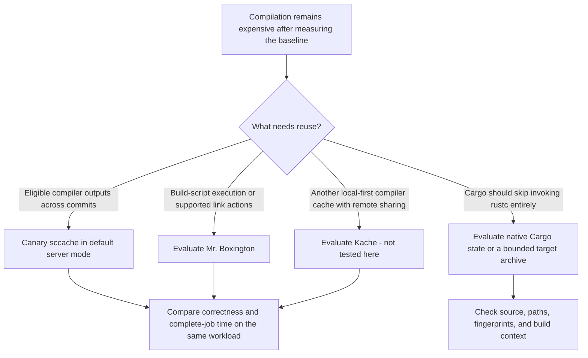

# sccache vs Mr. Boxington vs Kache

This page owns compiler-cache selection across the three tools. It compares mechanisms and the evidence available here; it is not a three-way benchmark. Adoption status is canonical in [Decisions](../decisions/README.md), and the wider [strategy map](../approaches/README.md) includes Cargo archives, native disks, and container builders.

## Choose an evaluation

These are starting points for a canary, not exclusive capabilities or promises of a winner. Follow [sccache](sccache.md), [Mr. Boxington](mr-boxington.md), [Kache](kache.md), or [persistent state](../approaches/persistent-state.md) for the selected branch.

## Mechanism and support comparison

Source review: 2026-09-15. The source baselines below are newer than some archived experiments. A release's advertised support does not establish that a particular workload is cacheable or correct.

| Question                       | sccache                                                                                                                                  | Mr. Boxington (`mbx`)                                                                                                                                                                                        | Kache                                                                                                                                                                                                                   |
| ------------------------------ | ---------------------------------------------------------------------------------------------------------------------------------------- | ------------------------------------------------------------------------------------------------------------------------------------------------------------------------------------------------------------ | ----------------------------------------------------------------------------------------------------------------------------------------------------------------------------------------------------------------------- |
| Source baseline                | [v0.17.0 Rust support](https://github.com/mozilla/sccache/blob/v0.17.0/docs/Rust.md)                                                     | [v1.11.1 limits](https://github.com/jdx/mr-boxington/blob/v1.11.1/docs/limits.md)                                                                                                                            | [v0.16.0 README](https://github.com/kunobi-ninja/kache/blob/v0.16.0/README.md) and dated live docs                                                                                                                      |
| Open-source component          | [Apache-2.0 repository](https://github.com/mozilla/sccache)                                                                              | [MIT repository](https://github.com/jdx/mr-boxington)                                                                                                                                                        | [Apache-2.0 repository](https://github.com/kunobi-ninja/kache)                                                                                                                                                          |
| Main reusable unit             | Eligible compiler invocation outputs.                                                                                                    | Modelled compilation, build-script execution, and supported linking actions.                                                                                                                                 | Content-addressed compiler outputs, with a local store and optional remote sharing.                                                                                                                                     |
| Rust linking and build scripts | Rust invocations that invoke a linker are not cached; compiling a build-script binary is different from caching its execution.           | Describes native executable, test, and proc-macro support on modelled host toolchains; build-script execution reuse depends on tracked inputs and captured outputs. Unsupported environments bypass caching. | The live [comparison](https://kunobi.ninja/docs/kache/getting-started/comparison) describes eligible Rust executable caching on Linux/macOS. Verify release/platform limits; do not infer build-script execution reuse. |
| Storage and transport          | [Multiple backends](https://github.com/mozilla/sccache/tree/v0.17.0/docs), including disk, S3, GHA, WebDAV, and multilevel arrangements. | Local objects and remote/GitHub integrations; the action's GitHub payload can also contain target state.                                                                                                     | Rust artifacts can use S3-compatible or filesystem remotes; v0.16.0 describes C/C++ object caching as local-only.                                                                                                       |
| CI integration trap            | Install and configure the wrapper/backend before server startup; stop/drain behavior matters for remote publication.                     | Record binary, action, and payload separately. The current action defaults to `target`; explicitly select `objects` for clean-target compiler-cache experiments.                                             | Distinguish the local cache, its optional archive transport, and direct remote synchronization; include sync and shutdown in job timing.                                                                                |
| Incremental compilation        | Rust incremental compilation is not supported for cacheable invocations.                                                                 | Shared action reuse and private learned incremental state are different modes; incremental compilations are not published to the shared cache.                                                               | Describes isolated learned incremental reuse; qualify its interaction with exact hits and remote sharing for the selected release.                                                                                      |
| Evidence in this archive       | Representative direct-S3 experiments and mode comparisons.                                                                               | Same-job experiments plus corrected fresh-runner target/object comparisons on mbx 1.11.1; target won overall, while object mode remained behind sccache after restore/import.                                  | **Not installed, tested, benchmarked, or adopted.**                                                                                                                                                                     |

Use the [Mr. Boxington action documentation](https://mr-boxington.jdx.dev/github-action), [Kache CI guide](https://kunobi.ninja/docs/kache/remote-cache/ci), and [compiler-cache integration diagnostics](../operations/diagnosing-compiler-cache-integration.md) for lifecycle details. Upstream comparison pages describe their authors' workloads; they do not resolve this archive's selection.

## How to compare fairly

Use one wrapper configuration at a time unless an explicitly supported composition is the experiment. Fix source, resolved compiler, target triple, flags, features, profile, build command, runner resources, and trust boundary. Record native dependency and linker coverage; unsupported work still costs time even with a high hit rate.

Measure cold/population, same-source fresh-runner reuse, and changed-source jobs separately. Test a failed build, a missing remote, and a restored cache that contains no useful entries. Verify output correctness and include setup, restore, compilation, linking, export, and teardown. An exact archive hit, same-job warm build, or upstream speedup is insufficient evidence of cross-run benefit. Use the existing [measurement procedure](../operations/measuring-cache-performance.md) and [JSONL contract](../reference/cache-measurement-schema.md).

## Evidence and decision

The [Mr. Boxington vs sccache evidence](../evidence/mr-boxington-vs-sccache.md) owns the historical paired trials; [cache strategy benchmarks](../evidence/cache-strategy-benchmarks.md) own the broader direct-S3 workload. Do not combine their timings into a three-tool ranking. The current selections and candidate statuses remain [D7, D9, and D10](../decisions/README.md).
